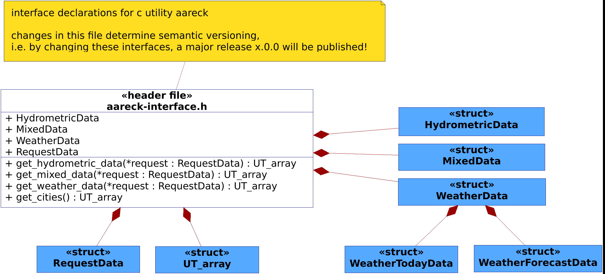

# aareck

[![stable-release-shields.io-url][stable-release-shields.io-url]][stable-release-github-url] 
[![npm-shields.io-url][npm-shields.io-url]][npm-url] 
[![git-shields.io-url][git-shields.io-url]][git-url] 
[![gloc-shields.io-url][gloc-shields.io-url]][gloc-github-url] 
[![license-shields.io-url][license-shields.io-url]][license-github-url] 

[stable-release-shields.io-url]: https://img.shields.io/github/v/tag/aareck/aareck.svg?logo=github&color=brightgreen&label=release
[stable-release-github-url]: https://github.com/svensson84/NOTAVAILABLE
[npm-shields.io-url]: https://img.shields.io/npm/v/aareck.svg?color=blue
[npm-url]: https://npmjs.com/package/aareck
[git-shields.io-url]: https://img.shields.io/badge/git--repo-aareck.git-blue
[git-url]: https://npmjs.com/package/aareck.git
[gloc-shields.io-url]: https://img.shields.io/badge/gloc-UNAVAILABLE-blue
[gloc-github-url]: https://github.com/kas-elvirov/gloc
[license-shields.io-url]: https://img.shields.io/badge/license-MIT-yellow
[license-github-url]: https://github.com/svensson84/aareck/blob/master/LICENSE

> **aareck** -- aare check  
> Reports hydrometric and weather data from the most beautiful river in Switzerland named "Aare".

## Table of Contents
1. [About](#about)
2. [Build](#build)
3. [Run](#run)
4. [Examples](#examples)
5. [Documentation](#documentation)
6. [Acknowledgements](#acknowledgements)
7. [Copyright](#copyright)

## About

TODO

## Build

### Prerequisites

TODO 

1) curl
2) json-c library

### Build Commands
~~~
git clone https://github.com/svensson84/aareck.git ~/aareck
cd ~/aareck
make
make install
~~~

## Run

~~~
aareck
~~~

## Examples

~~~
TODO
~~~

## Documentation

### Architecture

~~~
TODO
~~~

<figure>
  
   
  <figcaption><b>Figure 1</b>: uml diagram for public api <i>aareck-api.h</i> (Source: Zaugg S., 2022)</figcaption>
</figure>

### Semantic Versioning

~~~
TODO
~~~

## Acknowledgements
Special thanks to Christian Studer and Aare.guru GmbH for providing their [Aare.guru API](https://aareguru.existenz.ch/ "Aare.guru API")  
I would also like to say a special thank you to Job Vranish for sharing his smart and clean [Makefile](https://spin.atomicobject.com/2016/08/26/makefile-c-projects/ "Makefile")

## Copyright

© 2022 Sven Zaugg <zaugg84@gmail.com>

aareck is released under an MIT-style license; see [LICENSE](https://github.com/svensson84/aareck/blob/master/LICENSE "LICENSE") for details.
