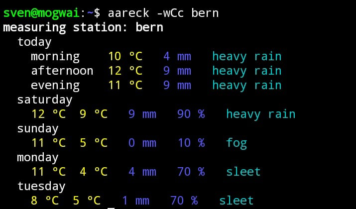

# aareck

[![stable-release-shields.io-url][stable-release-shields.io-url]][stable-release-github-url] 
[![npm-shields.io-url][npm-shields.io-url]][npm-url] 
[![git-shields.io-url][git-shields.io-url]][git-url] 
[![gloc-shields.io-url][gloc-shields.io-url]][gloc-github-url] 
[![license-shields.io-url][license-shields.io-url]][license-github-url] 

[stable-release-shields.io-url]: https://img.shields.io/github/v/tag/svensson84/aareck.svg?logo=github&color=brightgreen&label=release
[stable-release-github-url]: https://github.com/svensson84/aareck/releases/tag/0.3.0
[npm-shields.io-url]: https://img.shields.io/npm/v/aareck.svg?color=blue
[npm-url]: https://npmjs.com/package/aareck
[git-shields.io-url]: https://img.shields.io/badge/git--repo-aareck.git-blue
[git-url]: https://npmjs.com/package/aareck.git
[gloc-shields.io-url]: https://img.shields.io/badge/gloc-2.0k-blue
[gloc-github-url]: https://github.com/kas-elvirov/gloc
[license-shields.io-url]: https://img.shields.io/badge/license-MIT-yellow
[license-github-url]: https://github.com/svensson84/aareck/blob/master/LICENSE

> **aareck** -- aare check  
> Reports hydrometric and weather data from the most beautiful river in Switzerland named "Aare".

## Table of Contents
1. [About](#about)
2. [Build](#build)
3. [Run](#run)
4. [Examples](#examples)
5. [Documentation](#documentation)
6. [Acknowledgements](#acknowledgements)
7. [Sources](#sources)
8. [Copyright](#copyright)

## About

**aareck** -- aare check is a C program (CLI) for unix/linux systems. 
aareck reports hydrometric and weather data from the most beautiful river in Switzerland named "Aare".

## Build

### Prerequisites

aareck depends on following C libraries: 

1) curl
2) json-c

### Build Commands
~~~
git clone https://github.com/svensson84/aareck.git ~/aareck
cd ~/aareck
sudo make
sudo make install
~~~

## Run

~~~
aareck
~~~

## Examples

### List cities of all measuring stations

~~~
aareck -l
~~~

<figure>
  
  <figcaption><b>Figure 1</b>: Example 1 <i>aareck -l</i> (Source: Zaugg S., 2022)</figcaption>
</figure>

### Report hydraulic measurements from city brienz with colorized output

~~~
aareck -hCc brienz
~~~

<figure>
  
  <figcaption><b>Figure 2</b>: Example 2 <i>aareck -hCc brienz</i> (Source: Zaugg S., 2022)</figcaption>
</figure>

### Report mixed measurements from multiple cities with colorized output

~~~
aareck -mCc 'thun biel brugg'
~~~

<figure>
  
  <figcaption><b>Figure 3</b>: Example 3 <i>aareck -mCc 'thun biel brugg'</i> (Source: Zaugg S., 2022)</figcaption>
</figure>

### Report weather forecast for city bern with colorized output

~~~
aareck -wCc bern
~~~

<figure>
  
  <figcaption><b>Figure 4</b>: Example 4 <i>aareck -wCc bern/i> (Source: Zaugg S., 2022)</figcaption>
</figure>

## Documentation

### Architecture

#### Public Interface Declarations
Figure 5 shows aareck's public interface declarations.
Changes in those interface declarations lead to new major realeases x.0.0 (semantic versioning)

<figure>
  
   
  <figcaption>
  <b>Figure 5</b>: uml data diagram for public interface declarations <i>aareck-interface.h</i> (Source: Zaugg S., 2022)</figcaption>
</figure>

#### Sequence Diagram
Figure 6 shows an exemplary sequence to retrieve measurement data of the "Aare" river.

<figure>
  
   
  <figcaption><b>Figure 6</b>: uml sequence diagram for function <i>show_hydrometric_data(*request)</i> (Source: Zaugg S., 2022)</figcaption>
</figure>

## Acknowledgements
Special thanks to Christian Studer and Aare.guru GmbH for providing their [Aare.guru API](https://aareguru.existenz.ch/ "Aare.guru API")  
I would also like to say a special thank you to Job Vranish for sharing his smart and clean [Makefile](https://spin.atomicobject.com/2016/08/26/makefile-c-projects/ "Makefile")

## Sources
- measurements data swiss wide: [Bundesamt für Umwelt, Abteilung Hydrologie](https://www.hydrodaten.admin.ch/de)
- measurements data for "Olten": [TemperAare](https://temperaare.ch) App ([Android](https://play.google.com/store/apps/details?id=ch.oetiker.temp_aar_ature&hl=en&gl=US) / [iOS](https://apps.apple.com/de/app/temperaare/id1470201037)) von [Tobias Oetiker](https://www.oetiker.ch).
- weather measurements data: [MeteoSchweiz, SwissMetNet](https://opendata.swiss/en/dataset/automatische-wetterstationen-aktuelle-messwerte)
- weather forecasts: sponsored by [Meteotest](https://meteotest.ch/produkt/webservices)
- measurements data are exposed by [Existenz.ch APIs](https://api.existenz.ch).

## Copyright

© 2022 Sven Zaugg <zaugg84@gmail.com>

aareck is released under an MIT-style license; see [LICENSE](https://github.com/svensson84/aareck/blob/master/LICENSE "LICENSE") for details.
	
